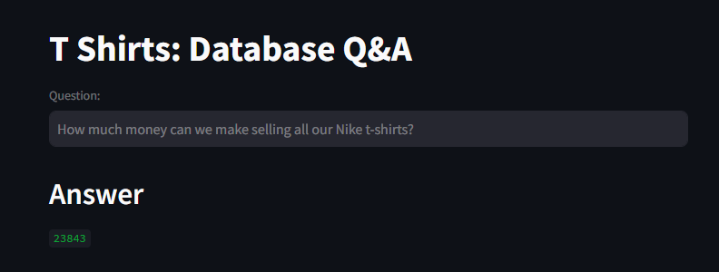

# Talk to a Database using natural language

This is an end to end LLM project based on Gemini pro and Langchain.
User asks questions in a natural language and the system generates answers by converting those questions to an SQL query and
then executing that query on MySQL database. 
The system is intelligent enough to generate accurate queries for given question and execute them on MySQL database



## Project Highlights

- an LLM based question and answer system that uses
  - Gemini Pro
  - Hugging face embeddings
  - Streamlit for UI
  - Langchain framework
  - Chromadb as a vector store
  - Few shot learning
- In the UI, you can ask questions in a natural language and it will produce the answers

## Usage

1. Set up your API key either using system variables or .env file.

2. Run the Streamlit app by executing:
```bash
streamlit run main.py

```

3.The web app will open in your browser where you can ask questions

## Sample Questions
  - How many total t shirts are left in total in stock?
  - How many t-shirts do we have left for Nike in XS size and white color?
  - How much is the total price of the inventory for all S-size t-shirts?
  - How much sales amount will be generated if we sell all small size adidas shirts today after discounts?
  
## How it works

1. User sends a question about the database
2. Using vector embeddings, similar examples are found and provided to the LLM for few-shot prompting
3. Table information is extracted about the database and provided to the LLM
4. The LLM generates the query to execute on the database
5. The query is executed and the answer is formatted and returned to the user